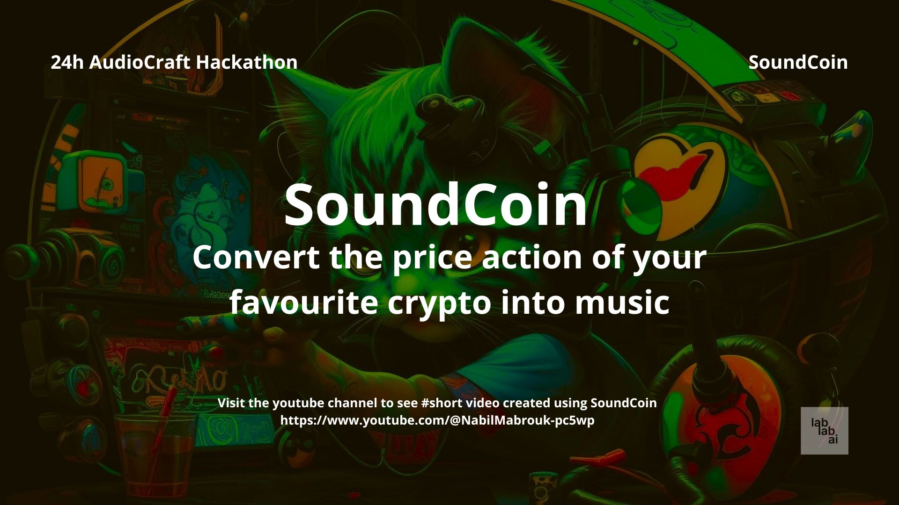

SoundCoin
========

Introduction
------------

SoundCoin is a unique project that combines the world of cryptocurrency and music. Using AudioCraft, SoundCoin converts the price action of any cryptocurrency into a melodious tune, creating a harmonious blend of sound and visuals. The project uses Python programming language and various libraries such as openai, Matplotlib, and moviepy to achieve this fusion of art and technology.

Features
--------

* Convert cryptocurrency price action into musical notes
* Generate a short video featuring the converted audio and the original currency chart
* Customizable options for selecting the cryptocurrency, time frame, and musical instruments
* User-friendly interface for easy usage

Usage
-----

1. Clone the repository and install required dependencies using pip.
2. Run the main script (soundcoin.py) and select the desired cryptocurrency, time frame, and musical instrument.
3. The system will generate a short video featuring the converted audio and the original currency chart.

Dependencies
------------

* requirements.txt

Contributing
------------

Contributions are welcome! If you have ideas or suggestions for improving the project, feel free to fork the repository, make changes, and submit a pull request.

License
-------

The MIT License (MIT)

Copyright (c) 2023 Your Name

Permission is hereby granted, free of charge, to any person obtaining a copy of this software and associated documentation files (the "Software"), to deal in the Software without restriction, including without limitation the rights to use, copy, modify, merge, publish, distribute, sublicense, and/or sell copies of the Software, and to permit persons to whom the Software is furnished to do so, subject to the following conditions:

The above copyright notice and this permission notice shall be included in all copies or substantial portions of the Software.

THE SOFTWARE IS PROVIDED "AS IS", WITHOUT WARRANTY OF ANY KIND, EXPRESS OR IMPLIED, INCLUDING BUT NOT LIMITED TO THE WARRANTIES OF MERCHANTABILITY, FITNESS FOR A PARTICULAR PURPOSE AND NONINFRINGEMENT. IN NO EVENT SHALL THE AUTHORS OR COPYRIGHT HOLDERS BE LIABLE FOR ANY CLAIM, DAMAGES OR OTHER LIABILITY, WHETHER IN AN ACTION OF CONTRACT, TORT OR OTHERWISE, ARISING FROM
